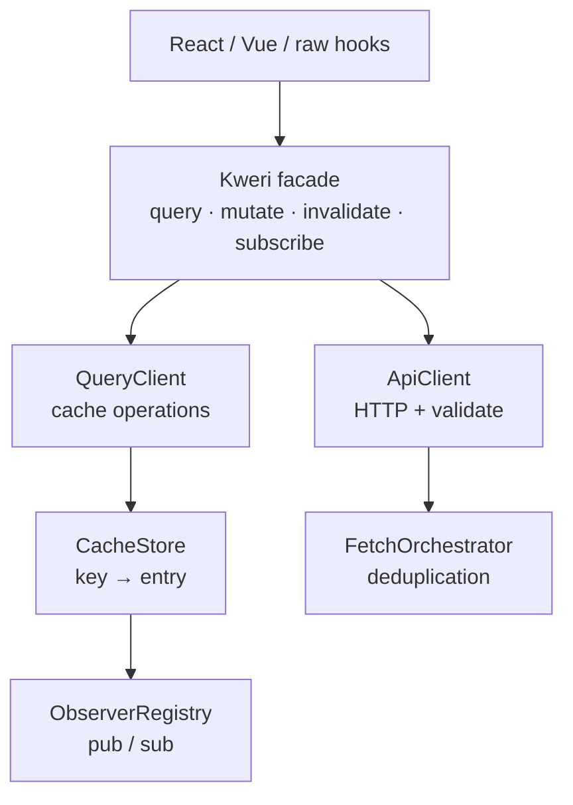

## What is Kweri?

Kweri is a lightweight, framework-agnostic API client built around a **stale-while-revalidate** caching strategy. It gives you the ergonomics of TanStack Query without locking you into any specific framework — the same `Kweri` instance works in React, Vue, plain JavaScript, Node.js, and edge runtimes.

At its core, Kweri manages three things:

- **Fetching** — deduplicating concurrent requests for the same query
- **Caching** — storing responses with configurable freshness and lifetime
- **Subscriptions** — notifying any number of observers when cached data changes

Framework-specific hooks (React, Vue) are thin adapters layered on top. The cache logic itself has no dependency on any UI library.

## Key features

<CardGroup cols={2}>
  <Card title="Type-safe endpoints" icon="shield-check">
    Define endpoints once with TypeBox schemas. Parameter and response types are inferred automatically — no codegen needed for custom endpoints.
  </Card>
  <Card title="Smart caching" icon="database">
    Stale-while-revalidate with per-instance `staleTime` and `cacheTime`. Fresh data is served instantly; stale data is background-refetched.
  </Card>
  <Card title="Request deduplication" icon="copy-slash">
    Concurrent requests for the same query share a single in-flight promise. No duplicate network calls, ever.
  </Card>
  <Card title="Framework agnostic" icon="puzzle-piece">
    Works with React (`useSyncExternalStore`), Vue (reactivity primitives), or raw subscriptions. One instance, any UI layer.
  </Card>
  <Card title="OpenAPI codegen" icon="wand-magic-sparkles">
    Run `kweri-gen` against any OpenAPI spec and get fully-typed client code and an `EndpointByMethod` map ready for path-based hooks.
  </Card>
  <Card title="Built-in DevTools" icon="magnifying-glass">
    A floating DOM overlay shows the live cache, observer counts, in-flight requests, and a structured event log. Auto-disabled in production.
  </Card>
</CardGroup>

## How it compares

Kweri is intentionally narrow in scope. It handles **server state** — fetching, caching, and synchronising remote data — not local UI state.

| Feature | Kweri | TanStack Query | SWR |
|---|---|---|---|
| Framework agnostic core | ✅ | ✅ | ✅ |
| TypeBox schema validation | ✅ | ❌ | ❌ |
| OpenAPI codegen | ✅ | ❌ | ❌ |
| Stale-while-revalidate | ✅ | ✅ | ✅ |
| Built-in devtools | ✅ | ✅ | ❌ |
| Bundle size | Small | Medium | Small |

## Architecture overview

